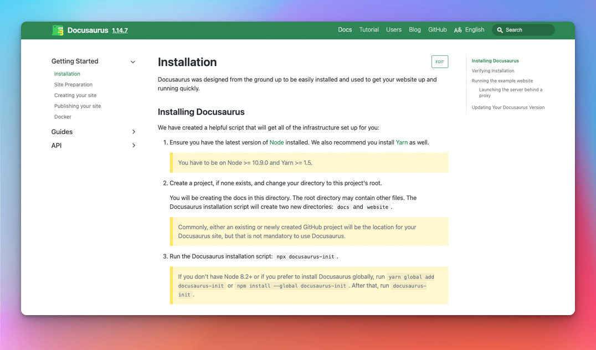

Today we are extremely happy to finally **announce Docusaurus 2.0**!

At [**Meta Open Source**](https://opensource.fb.com/), we believe Docusaurus will help you build the **best documentation websites** with **minimal effort**, letting you **focus on what really matters**: writing the content.

After **4 years of work, [75 alphas](https://github.com/facebook/docusaurus/releases/tag/v2.0.0-alpha.75) and [22 betas](https://github.com/facebook/docusaurus/releases/tag/v2.0.0-beta.22)**, the next generation of Docusaurus is **ready for prime-time**. From now on, we now plan to **respect [Semantic Versioning](https://semver.org/)** and will release more **frequent major versions**.


<!--truncate-->

```mdx-code-block
import BrowserWindow from '@site/src/components/BrowserWindow';
import ColorModeToggle from '@theme/Navbar/ColorModeToggle';
import useBaseUrl from '@docusaurus/useBaseUrl';
import ThemedImage from '@theme/ThemedImage';
```

## What is Docusaurus exactly?

Docusaurus helps you ship **beautiful documentation websites** in **no time**.

Focus on your content: just write **Markdown files**. Docusaurus will generate an optimized **static website** for you, easy to **host anywhere**.

Docusaurus is **full-featured** and very **flexible**: docs, blog, landing pages, versioning, search, i18n, a11y, theming, plugin system... You can easily **adapt its theme to match your brand** so that it integrates nicely with your main website or documentation portal. Its usage of **React** enables a **modern client-side navigation**, and the ability build an **interactive documentation**.

The Docusaurus philosophy is akin to **Pareto's law**: you can get **80% of the results** for **20% of the effort**. This enables you to compete with top-notch documentations with **minimal effort**.

<TweetQuote url="https://twitter.com/rachelnabors/status/1452697991039660038" handle="rachelnabors" name="Rachel Nabors">Unless you're spinning up a documentation team with engineering resources, you probably want Docusaurus!</TweetQuote>

Technically, Docusaurus is a flexible **static-site generator**. Think of it as a **simpler, opinionated alternative to [Gatsby](https://www.gatsbyjs.com/)**, GraphQL layer removed. We market it as a **documentation tool**, but you can use it for **other use-cases** as well: a blog, a knowledge base, a developer portfolio, a second brain, landing pages...

:::tip

Try Docusaurus now with our [online playgrounds](docs/playground) and [5 minutes tutorial](https://tutorial.docusaurus.io/) ⏱️

:::

## The story behind Docusaurus

Docusaurus was created at **Facebook Open Source** in **2017** (now [Meta Open Source](https://opensource.fb.com/)). We had a lot of internal and open-source projects to document. It's **complicated enough to write good documentation**, let alone creating the HTML, CSS and JavaScript for a good-looking website. We wanted project leaders to be able to **focus on the content**, and **Markdown** is great for that.

At that time, our solution was to **copy/paste a Jekyll template** over and over again. This naturally became **hard to maintain**, so we created a tool to **solve our own pain** once for all.

**[Docusaurus v1 was born](/blog/2017/12/14/introducing-docusaurus)!**




## From 1.0 to 2.0

[**Docusaurus v1**](http://v1.docusaurus.io/) has been very successful, but we **questioned some of our initial architectural choices**:

- React was only used as a **server-side templating language**, and not used on the client
- **Theming system was pretty limited**, and apart from changing a few colors with CSS, it was difficult to do more advanced customizations
- The **docs versioning system was confusing**, based on a diff algorithm
- The codebase was **monolithic**, not well-tested, scalable nor easy to extend

[**Docusaurus v2**](https://docusaurus.io/) has been **rebuilt** from the ground up with a new **modular architecture**:

- React is now also use on the client, enabling a **modern Single Page Application navigation**
- **Plugins** let the community contribute useful features as third-party packages
- **Theming** is more **flexible** than ever
- Docs versioning is now based on snapshot copies, much easier to understand
- We kept **everything good from v1**: docs, blog, pages, versioning, i18n...
- We implemented **several new features**

More details in the [Docusaurus 2 project announcement](https://docusaurus.io/blog/2018/09/11/Towards-Docusaurus-2) and [v1 to v2 migration guide](https://docusaurus.io/docs/migration)

## Who is using Docusaurus?

[Docusaurus v1](http://v1.docusaurus.io/) quickly built momentum at Facebook and in the frontend ecosystem, adopted by many popular projects: [React-Native](https://archive.reactnative.dev/), [Jest](https://archive.jestjs.io/), [Prettier](https://prettier.io/), [Babel](https://babeljs.io/)...

TODO better table + self-hosted images:

<table>
  <tr>
    <td>

</td>
    <td>

</td>
  </tr>
</table>

The work on Docusaurus v2 [started in 2018](/blog/2018/09/11/Towards-Docusaurus-2). Since then, the community has been quick to adopt it. It didn't take long for Docusaurus v2 to outgrow Docusaurus v1, despite being in beta.

TODO fix screenshot legend


TODO star history screenshot

TODO best of js screenshot

TODO mention top fb open-source project

Today, Docusaurus v2 is a great success even before its launch:

- We received so many [lovely testimonials](https://twitter.com/sebastienlorber/timelines/1392048416872706049)
- Companies like [1Password](https://blog.1password.com/docusaurus-documentation-framework/) and [Courier](https://www.courier.com/blog/how-we-built-our-documentation/) are writing down their positive experience
- Our [site showcase](/showcase) references hundreds of Docusaurus v2 websites (check our [favorites](/showcase?tags=favorite)), and this is only the tip of the iceberg.

TODO present a more exhaustive list of sites by vertical? + some screenshots?

:::tip

Please add your site to our showcase!

:::

## What's New in 2.0?

It would be difficult to list every single new feature coming with Docusaurus v2.

Let's focus on the features we believe are the **most impactful**.

### MDX

[MDX](https://github.com/mdx-js/mdx) allows you to **interleave React components** in your documentation.

This enables you to very easily build **interactive** documentation experiences.

A demo is worth a thousand words:

```md title="docs/my-document.mdx"
### Give it a try!

import ColorModeToggle from '@theme/ColorModeToggle';

<ColorModeToggle/>
```

```mdx-code-block
<BrowserWindow>

<h3>Give it a try!</h3>

<ColorModeToggle/>

</BrowserWindow>
```

:::info

MDX has its own [plugin system](https://mdxjs.com/docs/extending-mdx/): it enables you to customize your Markdown authoring experience, and even create your own Markdown syntax.

:::

### File system conventions

Our goal is to make Docusaurus very **intuitive** to use. We added file system conventions, and creating a new Markdown file is often enough to create a new doc page.


:::note

Markdown Front Matter and `_category_.json` allow you to customize the behavior: sidebar items ordering, sidebar labels...

:::

### Plugins

Docusaurus now has a **modular architecture** with a plugin system, also **powering the core features** like docs, blog, pages, search...

More importantly, it enables our community to **enhance Docusaurus** with additional features.

Let's highlight some good examples:

- [Redocusaurus](https://github.com/rohit-gohri/redocusaurus) allows you to integrate nicely an OpenAPI Redoc documentation in Docusaurus:


- [MDX-Mermaid](https://github.com/sjwall/mdx-mermaid) allows you to display Mermaid diagrams in your documentation:


- [Docusaurus Plugin Image Zoom](https://github.com/flexanalytics/plugin-image-zoom) allows users to click documentation images to zoom them:


:::tip

We reference some interesting plugins in our [community resources](/community/resources) page.

:::

### Theming

Theming is one of the most important features of Docusaurus: we believe a documentation should **adapt to your company's brand** and create a consistent experience.

Docusaurus theming gives a lot of **flexibility** on multiple levels:

- Customize CSS variables to adjust colors, fonts...
- Provide your own CSS stylesheets
- Implement your own theme from scratch
- **Override any React component** of our default theme (we call this [Swizzling](https://docusaurus.io/docs/swizzling)).

This enables users willing to invest a bit more time on **customizations** to build sites that **look different** one from another.

TODO better display

<table>
  <tr>
    <td>
      
    </td>
    <td>
      
    </td>
  </tr>
  <tr>
    <td>
      
    </td>
    <td>
      
    </td>
  </tr>
</table>

### Other features

Docusaurus 2 comes with many other useful features:

- Theme: dark mode, better UI and UX, flexible `themeConfig` options...
- Docs versioning: flexible plugin options to adapt to your workflow
- Docs sidebar: collapsible, category index...
- Blog: multiple authors, authors map, archive page...
- Markdown: tabs, math equations, live code blocks, linking, flexible Front Matter...
- Search: use the new Algolia DocSearch 3 experience
- Assets: make it easy to use images and other kind of files
- Internationalization: config options, default theme translations...
- Accessibility: aria labels, color contrasts, skip-to-content, keyboard navigation, progressive enhancement...
- SEO: sensible defaults, easy to customize, canonical url, social card, no-index, sitemap, microdata, hreflang...
- PWA: add offline support to your site, and make it installable
- Fail-fast: strict config validation, detect broken links, and prevent bad production deployments
- TypeScript support for config files, plugins, custom pages and theme authors
- Playgrounds: assess Docusaurus easily from your browser with [docusaurus.new](https://docusaurus.new)
- Canary releases: use the @canary npm tag to use the upcoming release before anyone else
- Tests: Docusaurus is well-tested, we dogfood features and ensure they keep working

## Why 2.0 now?

It is legitimate to **wonder why it took us 4 years to release Docusaurus 2.0**, considering the beta is already successful and **widely used in production**.

The reason is to be able to **respect [Semantic Versioning](https://semver.org/)**, which means Docusaurus major version will be incremented whenever we release a **breaking change**.

It is important for multiple reasons:

- It **guarantees simple minor version upgrades**, as long as you only use the [public API](/community/release-process#public-api-surface)
- It follows front-end ecosystem conventions
- A new major version is an opportunity to thoroughly document breaking changes
- A new major/minor version is an opportunity to communicate new features through a blog post

The problem is that our flexible theming system inherently creates a very **implicit API surface** on which it is **hard to know what is a breaking change** in the first place. Highly customized Docusaurus sites sometimes have a hard time upgrading Docusaurus because they achieve customizations using internal APIs. We took time to do some much-needed theme refactors, and clearly defining our [public API](/community/release-process#public-api-surface). We will continue to expand this public theming API so that the most common site customizations do not need to use any internal API.

:::info

From now on, Docusaurus will **release new major versions more regularly**. In practice, you can expect a **new major version every 2–4 months**.

[Major version numbers are not sacred](https://tom.preston-werner.com/2022/05/23/major-version-numbers-are-not-sacred.html), but we still group breaking changes together and avoid releasing major versions too often.

Check our [release process](/community/release-process) documentation for details.

:::

## What's Next?


The work on Docusaurus 3.0 has started, and this next version will be released only in a few months. We will backport retro-compatible changes in Docusaurus `2.x` minor versions to make them available as soon as possible to the community on a stable channel.

A sample of the features on our roadmap for the upcoming major versions of Docusaurus:

- [Upgrade to MDX 2.0](https://github.com/facebook/docusaurus/issues/4029)
- [Improve Markdown infrastructure](https://github.com/facebook/docusaurus/issues/4625)
- [Improve theming and swizzle](https://github.com/facebook/docusaurus/issues/6114)
- [TailwindCSS theme](https://github.com/facebook/docusaurus/issues/2961)
- [Theme; support custom item types for navbar, doc sidebar, blog sidebar, footer](https://github.com/facebook/docusaurus/issues/7227)
- [Dynamic navbar: navbar item activation strategies](https://github.com/facebook/docusaurus/issues/4389)
- [Custom Social Cards](https://github.com/facebook/docusaurus/issues/2968)
- [CSS-in-JS support](https://github.com/facebook/docusaurus/issues/3236)
- [Use Node.js ES Modules](https://github.com/facebook/docusaurus/issues/6520)
- [Improve build time performance](https://github.com/facebook/docusaurus/issues/4765)
- [Extend Docusaurus plugins, CMS integration](https://github.com/facebook/docusaurus/issues/4138)

## Thank You

We'd like to express our gratitude to [all our contributors](https://github.com/facebook/docusaurus/graphs/contributors), including:

- The Docusaurus core team: [Alexey Pyltsyn](https://github.com/lex111), [Joshua Chen](https://github.com/Josh-Cena), [Sébastien Lorber](https://github.com/slorber), [Yangshun Tay](https://github.com/yangshun) and all our [former team members](https://docusaurus.io/community/team)
- [Joel Marcey](https://github.com/JoelMarcey) for creating Docusaurus 1.0 and supporting the Docusaurus 2.0 project at Meta Open source
- [Paul O’Shannessy](https://github.com/zpao) for supporting the development of all the next versions of Docusaurus at Meta Open source
- [Eric Nakagawa](https://github.com/ericnakagawa) for creating our cutest mascot Slash
- [Endilie Yacop Sucipto](https://github.com/endiliey) for his significant [initial work on Docusaurus v2](/blog/2020/01/07/tribute-to-endi)
- [Clément Vannicatte](https://github.com/shortcuts), [Kevin Granger](https://github.com/Shipow) and the whole Algolia team for their support
- All the community members for making valuable code contributions, improving our documentation, and answering questions on [Discord](https://discordapp.com/invite/docusaurus)

We'd like to thank in particular all our **Docusaurus 2.0 early adopters** for assessing it alpha, beta and canary releases, providing a ton of **invaluable feedback**. We sincerely hope you had a great experience using it, and that you will continue to provide feedback on the upcoming releases of Docusaurus 3.0.

At [Meta Open Source](https://opensource.fb.com/), Docusaurus is one of our **most successful project**. We can't wait to see all the outstanding documentation websites that you will create! Don't forget to submit them to our [site showcase](/showcase).

**Now, let your imagination run wild 🤪!**
